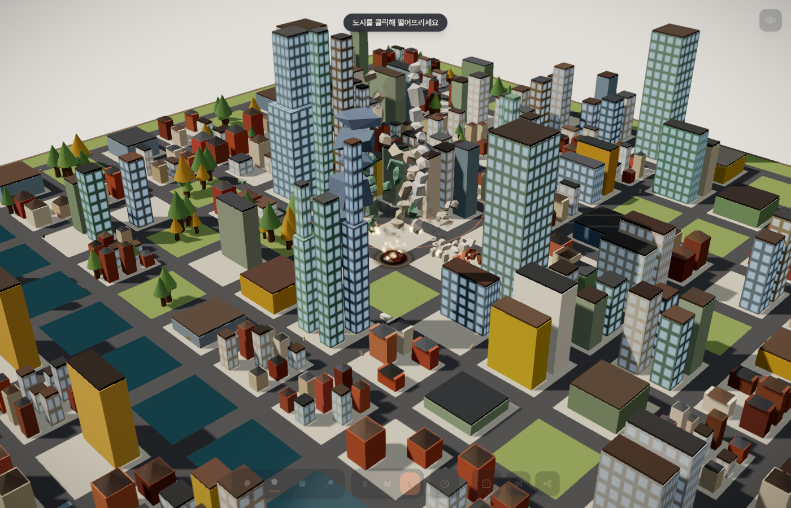
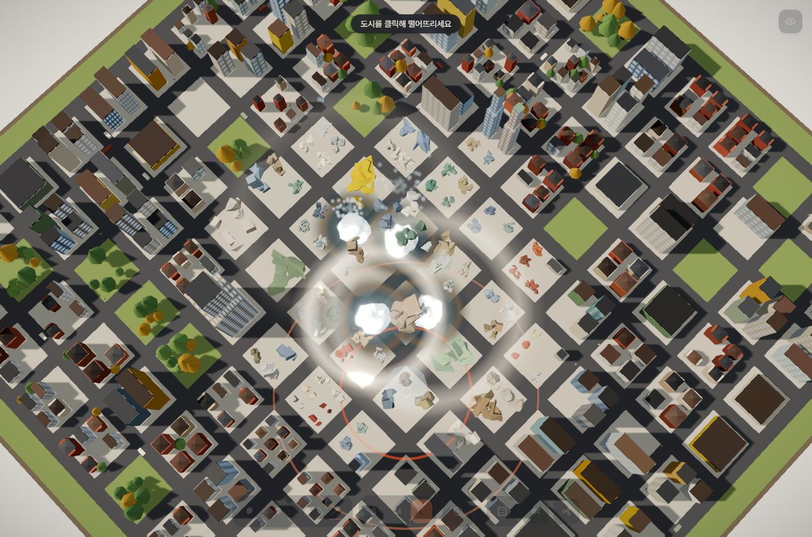

# 운석 도시 (meteor-city) ☄️🌆

> 절차적으로 생성되는 미니어처 3D 도시에 운석을 골라 떨어뜨려, 건물이 위에서부터 무너져 내리고 불과 연기가 치솟는 걸 지켜보는 물리 파괴 샌드박스


🔗 **라이브: https://meteor-city.vercel.app**



## 소개

매번 다르게 만들어지는 미니어처 3D 도시가 눈앞에 펼쳐집니다. 운석 종류와 크기를 고르고
도시의 아무 데나 클릭하면, 그 자리에 운석이 떨어져 건물을 부숩니다. 꼭대기를 맞으면 위층부터
차례로 으스러지며 발밑으로 무너져 내리고, 크레이터엔 운석이 반쯤 박히며 화염과 검은 연기가
치솟습니다. 도로 위를 다니던 자동차와 사람들은 충격파에 튕겨 나갑니다.

서버도 로그인도 없습니다. 모든 도시 생성·물리·파괴는 브라우저에서만 돌아가고, 같은 도시를
공유하고 싶으면 주소창의 시드 링크만 넘기면 됩니다. **"이 도시 부숴봐"** 하고요.

## ✨ 주요 기능

- 🎲 **절차적 랜덤 도시** — 시드 하나로 도로 격자·건물·나무·공원·강·다리가 매번 새롭게 조합됩니다. 같은 시드는 어느 기기에서든 똑같은 도시로 재현됩니다.
- ☄️ **운석 4종 × 크기 3단** — 암석형·철운석·파쇄형·혜성을 S/M/L 크기로. 종류마다 무게·낙하 속도·폭발 반경·크레이터·화면 흔들림이 다릅니다.
- 🎯 **클릭해서 원하는 곳에 낙하** — 조준 표시를 보며 도시의 원하는 지점을 정확히 타격. 고속 운석도 CCD로 건물을 관통하지 않습니다.
- 🏢 **위 → 아래 순차 붕괴** — 맞은 층부터 부서지고 아래층이 지지력을 잃으며 팬케이크식으로 무너져 내립니다. 한 번에 통째로 터지지 않는 실제 붕괴 연출.
- 🧱 **무게감 있는 잔해 + 흔적 잔존** — 콘크리트처럼 묵직하게 떨어져 튕기지 않고 발밑에 쌓입니다. 불규칙한 형태·크기의 파편이 잔해 더미로 바닥에 남습니다.
- 🔥 **화염 · 불티 · 연기** — 충돌 지점과 무너진 건물에서 불이 붙어 일렁이고, 불티가 솟고, 검은 연기 기둥이 오래 남습니다. 부술수록 도시가 아수라장이 됩니다.
- 🕳️ **크레이터 임베드** — 운석은 접촉 지점 아래 지면에 반쯤 박힌 채 정착하고, 그을음 크레이터가 남습니다.
- 🚗 **살아 있는 도시** — 자동차와 보행자가 도로망을 따라 돌아다니다 폭발 반경에 들면 튕겨 나갑니다.
- 🎬 **미니어처 룩** — 틸트시프트 DOF로 "책상 위 디오라마" 착시, 부드러운 그림자·앰비언트 오클루전·임팩트 순간의 블룸 섬광.
- 🔗 **시드 URL 공유** — `?seed=…&type=…&size=…` 로 지금 이 도시와 운석 설정을 그대로 링크에 담아 공유합니다.
- ⚙️ **자동 성능 티어** — GPU를 감지해 high/low 티어로 자동 조정(파편 상한·나무 수·그림자·포스트프로세싱). 저사양에서도 돌아갑니다.
- 🔒 **완전 클라이언트 · 무상태** — 서버·DB 없음. 정적 프리렌더로 배포됩니다.

## 🎮 조작법

- **떨어뜨리기**: 하단 바에서 운석 종류와 크기(S/M/L)를 고른 뒤 **도시를 클릭**하면 그 위치로 낙하합니다.
- **카메라**: 드래그로 회전, 스크롤로 줌 (OrbitControls). 최대 축소는 도시 전체가 프레임에 담기도록 제한됩니다.
- **슬로모**: 토글을 켜면 충돌 순간을 슬로모션으로 감상할 수 있습니다.
- **새 도시 / 리셋**: 도시를 다시 생성하거나 현재 도시를 원상 복구합니다.
- **공유**: 공유 버튼으로 현재 시드·운석 설정이 담긴 링크를 복사합니다.

## ☄️ 운석 4종

| 종류 | 특징 | 성격 |
|------|------|------|
| **암석형** (`rocky`) | 울퉁불퉁한 기본 암석 | 표준 밸런스 |
| **철운석** (`iron`) | 무겁고 치밀한 금속질 | 좁고 깊은 크레이터, 강한 펀치·흔들림 |
| **파쇄형** (`jagged`) | 각지고 삐뚤한 파편형 | 비대칭으로 흩뿌려지는 파괴 |
| **혜성** (`comet`) | 크고 가벼운 얼음덩이 | 넓고 얕은 폭발, 가장 밝은 섬광 |

크기 S/M/L은 반경과 폭발 반경에 곱해지는 배수라, 같은 종류라도 L은 훨씬 넓게 부숩니다.

## 🧠 어떻게 동작하나 (기술적 특징)

- **절차적 생성**: 시드 기반 결정론적 PRNG로 도로 격자 → 블록 타입 → 건물 아키타입(높이·너비)·나무·공원·강·다리를 생성합니다. 시드만 같으면 결과가 완전히 동일하므로 URL 공유로 재현됩니다.
- **Rapier3D 물리 (WASM)**: 강체 시뮬레이션은 고정 timestep(1/60) 누산기로 돌립니다. 파편은 `<RigidBody>` JSX가 아니라 **raw Rapier world + InstancedMesh 풀**로 임퍼러티브하게 관리해, 수백 개 파편에서도 React 리컨실러 부담이 없습니다.
- **복셀 청킹 파괴**: 건물을 실제 치수 기준으로 층·복셀 단위로 잘라 조각냅니다. 충돌 층부터 순차로 dynamic 전환해 위→아래 붕괴(pancaking)를 연출하고, 잠들어 정지한 파편은 정적 rubble 메시로 **베이크**해 흔적을 남기면서 물리 부담은 회수합니다.
- **파티클 FX**: 화염·불티·연기·먼지는 각각 예산 상한을 둔 GPU 파티클 필드로, 파편 예산과 분리해 관리합니다.
- **성능 예산**: 전역 활성 파편 상한·despawn·품질 티어(high/low)로 방어. 자세한 설계 근거는 [`docs/PROJECT.md`](docs/PROJECT.md), 아트 디렉션은 [`docs/DESIGN.md`](docs/DESIGN.md) 참고.



## 🛠 기술 스택

- **Next.js 16** (App Router) + **TypeScript**
- **React Three Fiber** + **drei** (Three.js)
- **Rapier3D** (`@dimforge/rapier3d-compat`, WASM 물리 엔진)
- **@react-three/postprocessing** (Bloom · TiltShift · N8AO · Vignette)
- 무상태 · 정적 프리렌더 · **Vercel** 배포

## 🚀 로컬 실행

```bash
npm install
npm run dev
```

[http://localhost:3000](http://localhost:3000) 을 브라우저에서 엽니다. 첫 로딩 시 Rapier WASM을 초기화합니다.

빌드 / 프리뷰:

```bash
npm run build
npm run start
```

## 📁 프로젝트 구조

```
app/                  Next.js App Router 엔트리
components/           Scene · HUD · PostFX · 로딩/에러 · Engine 러너
lib/
  city/               절차적 도시 생성 · 메시 빌드
  physics/            Rapier world · 운석 · 복셀 청킹 파편 풀
  fx/                 임팩트 · 화염/연기 파티클 · 카메라 셰이크
  agents.ts           자동차 · 보행자 로밍
  engine.ts           단일 useFrame 루프(물리·파편·FX 오케스트레이터)
  meteorPresets.ts    운석 4종 · 크기 배수
  quality.ts          GPU 품질 티어(high/low)
  share.ts            시드/타입/크기 ↔ URL (입력 검증)
docs/                 PROJECT.md(기획) · DESIGN.md(아트) · 스크린샷
```

## 🔒 무상태 & 공유

모든 계산은 클라이언트에서만 이뤄지고 서버로 전송되는 데이터는 없습니다. URL 쿼리(`seed`/`type`/`size`)는
정수 파싱·범위 클램프·화이트리스트로 검증하며(적대적 입력 방어), 외부 URL을 참조하거나 `innerHTML`을 만지지 않습니다.

---

made with ☄️ and 🔥
